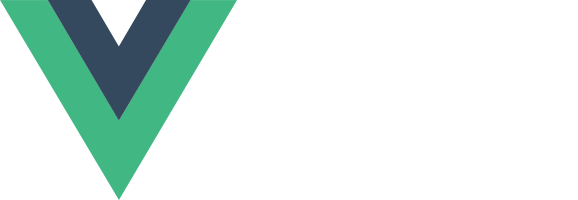
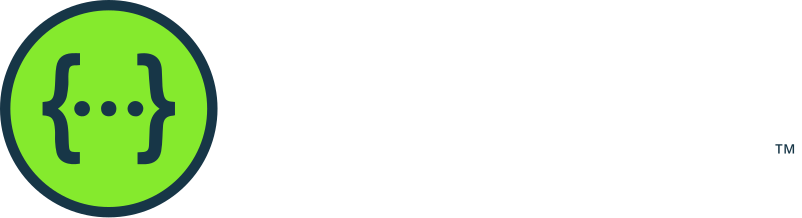

<p align="center"><a href="https://github.com/bettungdl" target="_blank"></a></p>

<p align="center">
 &nbsp;
&nbsp;
&nbsp;

</p>

## About This Project

This project is a basic full-stack platform built with **Vue.js** on the frontend and **Laravel** on the backend. Its goal is to provide a secure and scalable foundation for user management with role-based access, multilingual support, and documented APIs.

## [Frontend Features](https://github.com/bettungdl/crud-front)

The frontend application is developed in **Vue.js** and includes the following core features:

- **Login page** connected to the backend authentication API.
- **Dashboard** to display the main platform information after authentication.
- **Basic Users CRUD with Roles** to create, read, update, and delete users while assigning roles.
- **Light and Dark Theme** to improve usability and user experience.
- **Multi-language support** in **English** and **Spanish**.

The frontend must communicate with the backend by consuming the authentication and user management endpoints, including secure login and user creation with roles.

## [Backend Features](https://github.com/bettungdl/crud-front)

The backend is developed in **Laravel** and provides the APIs required by the Vue.js frontend.

Included API features:

- **Login endpoint** that authenticates users and generates an access token.
- **Protected Users CRUD endpoints with Roles** that require a valid login token to be consumed.
- **Role-based user management** to support authorization and access control.
- **Swagger API documentation** to clearly describe and test the available endpoints.

This backend is designed to serve as the business logic layer of the platform, handling authentication, authorization, and user administration.

## Database Features

The project uses **PostgreSQL** as its database engine.

Database requirements include:

- Creating and configuring the database in **PostgreSQL**.
- Running **Laravel migrations** to generate the database structure.
- Running **seeders** to populate the database with initial data required by the application.

## Installation

This document focuses on installation. It assumes the application will run on an **Ubuntu** server and will be accessed from a **Windows** environment. Up to the environment configuration stage, the setup flow is the same for both the frontend and the backend.

### Prerequisites

- **Node.js** `^22.18.0 || >=24.12.0`
- **npm**
- A reachable **Laravel API** base URL for the backend

### Project Setup

```sh
npm install
```

### Environment

Create the local environment file from the example file:

```sh
cp .env.example .env
```

Configure the main environment variables in the `.env` file:

```env
VITE_APP_TITLE=CRUD DSGDL
VITE_API_URL=http://YOUR_BACKEND_URL/api
```

- `VITE_APP_TITLE`: application title displayed in the frontend.
- `VITE_API_URL`: base URL used by the frontend to consume the Laravel API.

### Lint with [ESLint](https://eslint.org/)

```sh
npm run lint
```

### Type-Check, Compile and Minify for Production

```sh
npm run build
```

This project uses **Vue.js** for the frontend, **vue-i18n** for multilingual support, and **Axios** to consume the **Laravel API**.
